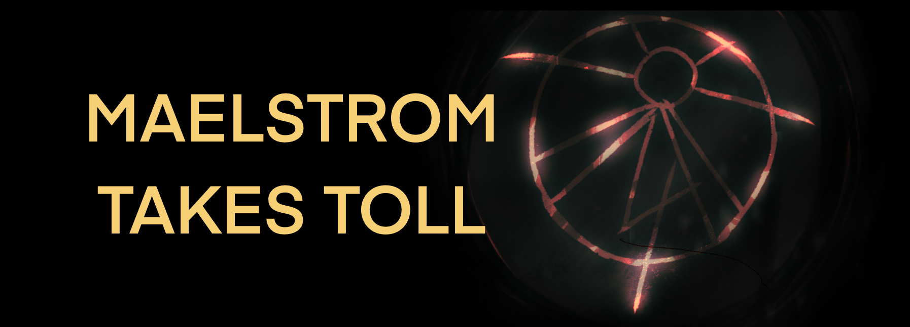

# What is this?

~~A personal site and~~ A wiki of a writing project **"Maelstrom Takes Toll"** using SvelteKit, [MDsveX](https://mdsvex.pngwn.io/) and [melt-ui](https://melt-ui.com/).

## Build

Prerequisites:

- [uv](https://docs.astral.sh/uv/) python project manager
- [Task](https://taskfule.dev) task runner

```sh
source .venv/bin/activate
task install
```

Create local development build (watching changes):

```sh
npm run dev
```

Create production-ready build:

```sh
npm run build
npm run preview
```

## Credits

Images used:

- [Linnaea Mallette, Armillary Sphere, Vintage drawing of the armillary sphere](https://www.publicdomainpictures.net/en/view-image.php?image=338833&picture=armillary-sphere*/) (License: CC0 Public Domain)
